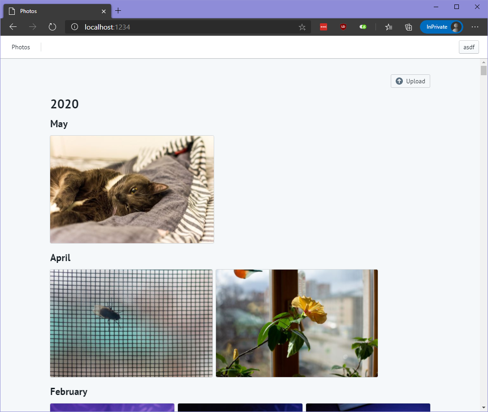

# Photos

Something that tries to be a self-hosted alternative to Google Photos

Demo: https://photos.usatiuk.com
(no need to enter a real email, something like asdf@asdf.com is enough, data is stored on tmpfs, reset every day)

## Getting started

### Not using docker

First, install all of the dependencies with `npm i` and `cd frontend && npm i`

You also need to create a ormconfig.json and ormconfig.test.json (only if you
want to run the tests). You can use ormconfig.example.json as an example (you
only need to change the database connection settings)

### Using docker

Open the workspace in a remote docker container using VSCode - everything should
be set up for you. You might need to rename `ormconfig.dockerdevexample.json` and
`ormconfig.dockerdevexample.test.json` to `ormconfig.json` and
`ormconfig.test.json` and install dependencies too (although it should be automatic)

Then start with `npm run dev` and visit http://localhost:1234 (Parcel dev server
is listening at http://localhost:1234, and koa at http://localhost:3000)

## Actually hosting this

The suggested way to host this is, agian, using Docker: you can find a
docker-compose example in `dockercomposeexample` folder

### Config options

* `PORT` - web server port

* `TYPEORM_HOST` - mariadb hostname

* `TYPEORM_USERNAME` - mariadb username

* `TYPEORM_PASSWORD` - mariadb password

* `TYPEORM_DATABASE` - mariadb database

* `TYPEORM_PORT` - mariadb port

* `JWT_SECRET` - JWT secret - set it to something random

* `HTTPS` (`"yes"`/`"no"`) - whether the server enforces HTTPS or not

* `SIGNUP_ALLOWED` (`"yes"`/`"no"`) - whether signups are allowed or not, persistent (but the first signup is always allowed)

* `API_ROOT`

* `WEB_ROOT`

### Additional config options if you're not using docker

* `DATA_DIR` - data directory for photos and uploaded files
